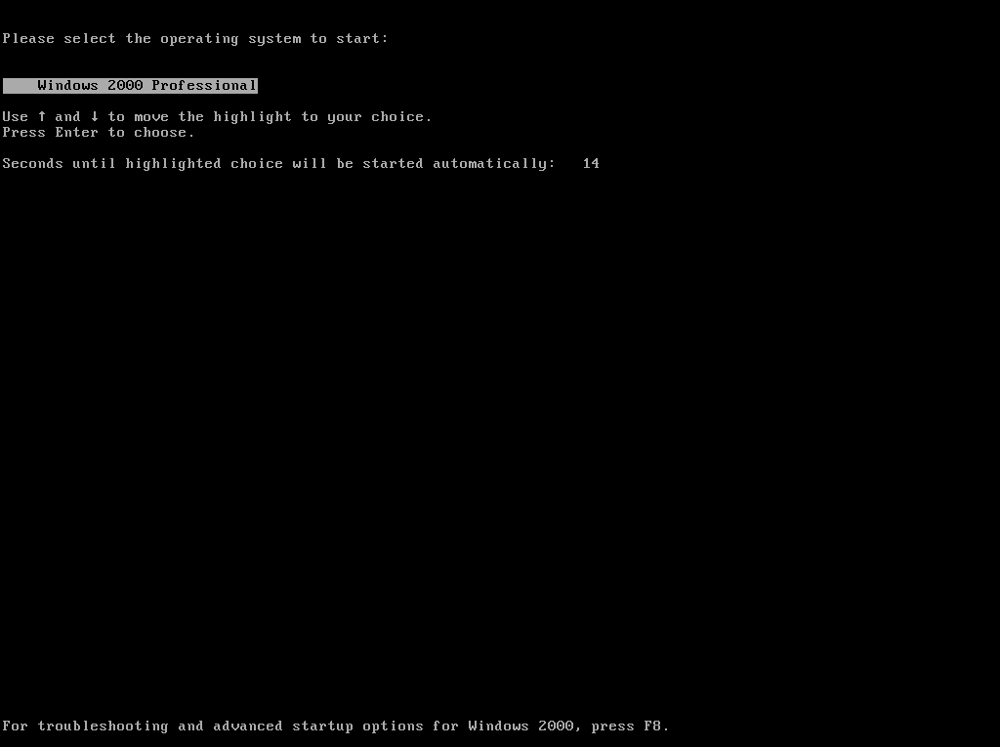

# Limine NTLDR

A fork of Limine that attempts to make Limine look like NTLDR (also known as OS Loader in NT 4 and below) from Windows 2000/XP 



Head to [CONFIG.md](CONFIG.md) for configuration options.

## ORIGINAL README

<p align="center">
    
</p>

### What is Limine?

Limine (pronounced as demonstrated [here](https://www.merriam-webster.com/dictionary/in%20limine))
is a modern, advanced, portable, multiprotocol bootloader and boot manager, also used
as the reference implementation for the [Limine boot protocol](PROTOCOL.md).

### Community, Support, and Donations

#### Donate
If you want to support the work I ([@mintsuki](https://github.com/mintsuki)) do on Limine, feel free to donate to me on Liberapay:
<p><a href="https://liberapay.com/mintsuki/donate"></a></p>

Donations welcome, but absolutely not mandatory!

#### Community
We have a Matrix room at [`#limine:matrix.org`](https://matrix.to/#/#limine:matrix.org)
if you need support, info, or you just want to hang out with us.

### Limine's boot menu


[Photo by Gundula Vogel](https://www.pexels.com/photo/ginger-cat-sitting-on-grass-25189639/)

### Supported architectures
* IA-32 (32-bit x86)
* x86-64
* aarch64 (arm64)
* riscv64
* loongarch64

### Supported boot protocols
* Linux
* [Limine](PROTOCOL.md)
* Multiboot 1
* Multiboot 2
* Chainloading

### Supported partitioning schemes
* MBR
* GPT
* Unpartitioned media

### Supported filesystems
* FAT12/16/32
* ISO9660 (CDs/DVDs)

If your filesystem isn't listed here, please read [the FAQ](FAQ.md) first, especially before
opening issues or pull requests related to this.

### Minimum system requirements
For 32-bit x86 systems, support is only ensured starting with those with
Pentium Pro (i686) class CPUs.

All x86-64, aarch64, riscv64 and loongarch64 (UEFI) systems are supported.

## Packaging status

All Limine releases since 7.x use [Semantic Versioning](https://semver.org/spec/v2.0.0.html) for their naming.

[](https://repology.org/project/limine/versions)

## Binary releases

For convenience, for point releases, binaries are distributed. These binaries
are shipped in the `-binary` branches and tags of this repository
(see [branches](https://github.com/limine-bootloader/limine/branches/all) and
[tags](https://github.com/limine-bootloader/limine/tags)).

For example, to clone the latest binary release of the `9.x` branch, one can do:
```bash
git clone https://github.com/limine-bootloader/limine.git --branch=v9.x-binary --depth=1
```
or, to clone a specific binary point release (for example `9.3.2`):
```bash
git clone https://github.com/limine-bootloader/limine.git --branch=v9.3.2-binary --depth=1
```

In order to rebuild host utilities like `limine`, simply run `make` in the binary
release directory.

Host utility binaries are provided for Windows.

## Build and Install Instructions

*The following steps are not necessary if cloning a binary release.*

See [INSTALL.md](INSTALL.md).

## Usage

See [USAGE.md](USAGE.md).

## 3rd Party Software Acknowledgments

See [3RDPARTY.md](3RDPARTY.md).
